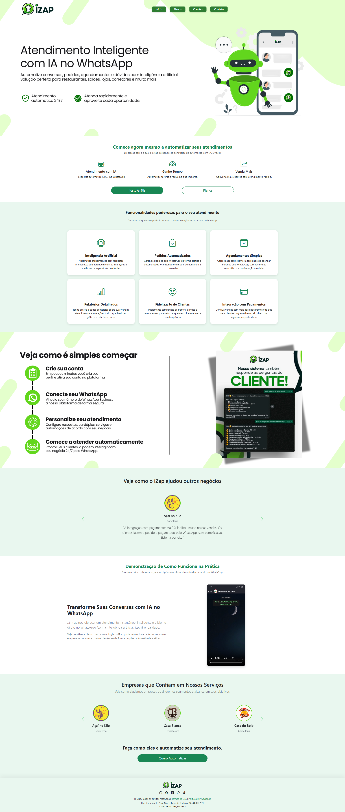
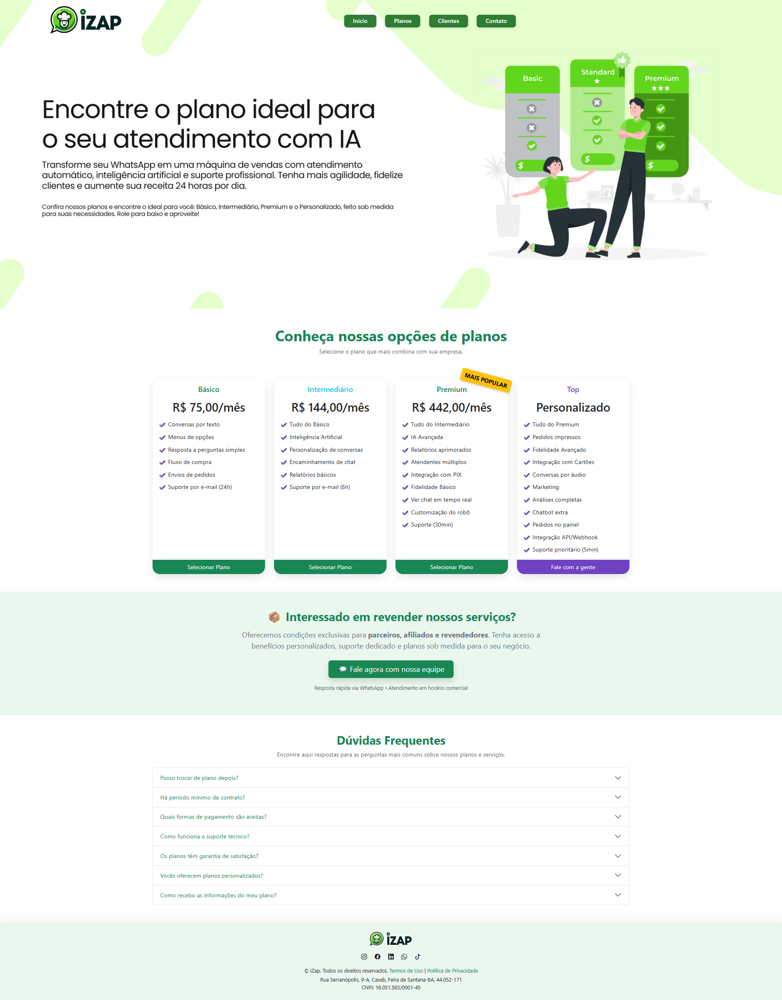
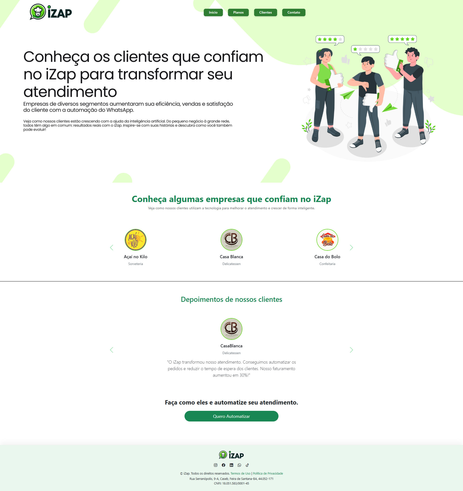
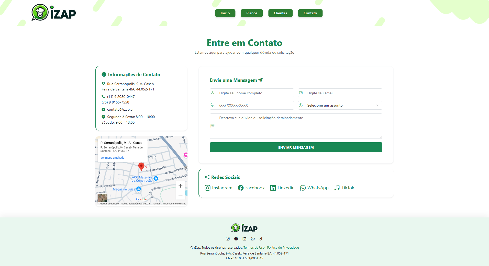

<h1 align="center">🤖 Site da Izap - Projeto Pessoal</h1>

Este projeto foi desenvolvido com o objetivo de demonstrar minhas habilidades em desenvolvimento front-end, aplicando conceitos e boas práticas para criar uma interface funcional e visualmente agradável, inspirada no site da Izap.

A Izap é uma empresa especializada em automação de atendimento via WhatsApp, utilizando inteligência artificial para otimizar processos em diversos setores. Seu foco principal é facilitar a comunicação e agilizar serviços para restaurantes, corretores, lojas e salões, permitindo que empresas automatizem pedidos, agendamentos e esclarecimento de dúvidas através do WhatsApp .

---

## 💡 Sobre o Projeto

Este projeto foi desenvolvido em um curto período de tempo com o objetivo de demonstrar minhas habilidades como desenvolvedor e apresentar um trabalho prático à equipe da Izap. Refiz o layout do site da empresa como um projeto pessoal, buscando mostrar o que sou capaz de entregar em um prazo reduzido.

Embora tenha sido criado em apenas dois dias, acredito que este projeto é uma excelente representação do meu empenho e das minhas capacidades técnicas. Algumas melhorias ainda estão em andamento, mas o projeto já transmite uma boa ideia do que posso contribuir.

🔗 <a href="https://i-zap.vercel.app/" target="_blank">Clique aqui para acessar o projeto de demonstração</a>

🎥 <a href="https://youtu.be/qrzuNBES5hQ" target="_blank">Clique aqui para assistir ao vídeo demonstrativo</a>

---

## ✅ Funcionalidades

- 🖥️ Design simples e intuitivo  
- 📱 Layout responsivo para diferentes dispositivos  
- 🔄 Navegação fluida entre as páginas  
- 🧭 Barra de navegação com links importantes  
- 🖼️ Imagens e conteúdos dinâmicos com foco no serviço da empresa

---

## 🧰 Tecnologias Utilizadas

<ul>
  <li>HTML5</li>
  <li>CSS3</li>
  <li><a href="https://getbootstrap.com" target="_blank" rel="noopener noreferrer">Bootstrap 5</a></li>
</ul>

---

## 📚 O que eu aprendi com esse projeto

- Implementação de um design responsivo utilizando Bootstrap  
- Organização de código HTML e CSS para otimização e manutenção  
- Desenvolvimento de uma interface amigável e acessível  
- Validação de ideias rapidamente e aplicação de feedbacks

---

## 🖼️ Imagens do Projeto

### 📌 Página Inicial

### 📌 Página de Planos

### 📌 Página de Clientes

### 📌 Página de Contatos

---

Desenvolvido com 💜 por **Ricardo Rodrigues** | <a href="https://www.linkedin.com/in/ricardo-rodrigues0/" target="_blank">LinkedIn</a>
